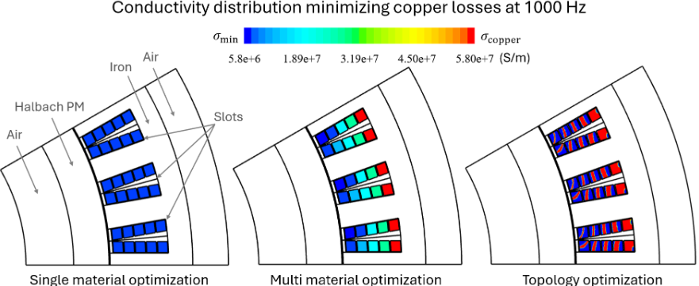

# Topopt-AC-losses (demo)

  

Parametric and topology optimization of armature conductors' in electrical machines to minimize AC losses.

## 1) Quickstart

Click here to access and execute the notebooks in your browser:

## 2) Reference

This repository is for demo purposes and may not be up to date.
See [this repository](https://github.com/tcherrie/topopt-AC-losses) to access latest and previous versions.

This repository makes use of [JupyterLite](https://github.com/jupyterlite) and [NGSolve](https://ngsolve.org/). Many thanks to their developers!

## 3) License

Copyright (C) Théodore CHERRIERE (theodore.cherriere@centralesupelec.fr)

This code is free software: you can redistribute it and/or modify it under the terms of the GNU Lesser General Public License as published by the Free Software Foundation, either version 3 of the License, or (at your option) any later version.

This code is distributed in the hope that it will be useful, but WITHOUT ANY WARRANTY; without even the implied warranty of MERCHANTABILITY or FITNESS FOR A PARTICULAR PURPOSE. See the GNU Lesser General Public License for more details.

You should have received a copy of the GNU Lesser General Public License and of the GNU General Public License along with this code. If not, see <http://www.gnu.org/licenses/>. Please read their terms carefully and use this copy of the code only if you accept them.